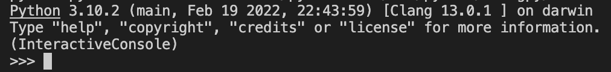

# Day 1: Python開発環境構築

# アジェンダ
1. 開発環境を構築しよう（ハンズオン）
2. Pythonプログラムをデバッグしてみよう（モブプログラミング）

# 1. 開発環境を構築しよう
## 目標
ローカルにPythonの開発環境を構築してVSCode上でPythonプログラムを実行できるようにすること

## 0. Requirements
以下のツールがインストールされていることを前提にしています。
インストールしていない人は事前にインストールしておいてください。

- [git for windows](https://gitforwindows.org/)
- [VS Code](https://code.visualstudio.com/)

## 1. Clone Repository
このレポジトリを適当なディレクトリにcloneしてください。

```bash
git clone https://github.com/autotaker/training-domo.git
```

## 2. Install Python

1. [Microsoft Store](https://www.microsoft.com/ja-jp/p/python-310/9pjpw5ldxlz5)からPython 3.10をインストールしてください。
   - Windows以外の場合は [Python公式](https://www.python.org/downloads/release/python-3102/)からダウンロードしてください。
1. Powershellを開き、Pythonのバージョンを確認してください。`3.10.2`が表示されればOKです。

   ```
   python --version
   >>> Python 3.10.2
   ```

## 3. Install Pipenv
Pipenvをインストールします。

1. Powershellを開き、以下のコマンドで`pipenv`をインストールします。

   ```bash
   pip install --user pipenv
   ```

   - 社内プロキシ等を使っている場合、SSLの証明書エラーが発生することがあります。
     その場合はルート証明書をPEM形式で保存し、以下のコマンドでpipの`global.cert`オプションを設定してください。
     
     ```bash
     pip config --user set global.cert {ルート証明書へのパス}
     ```
2. 以下のコマンドでバージョンを確認してください。

   ```
   pipenv --version
   >>> pipenv, version 2022.1.8
   ```

## 4. Install dependencies
pipenvを使って依存ライブラリをダウンロードします。

1. このレポジトリ直下(`Pipefile`が存在するディレクトリ)で以下のコマンドを実行して依存ライブラリをインストールしてください。

   ```
   pipenv install --dev
   ```

   - 社内プロキシ等を利用している場合、requestsパッケージを経由したHTTPSリクエストが証明書エラーとなることがあります。その場合は、ルート証明書をPEM形式で保存し、`REQUESTS_CA_BUNDLE`環境変数でそのファイルへのパスを指定してください。

     ```powershell
     $env:REQUESTS_CA_BUNDLE = "{ルート証明書のパス}" # 現在のプロセスの環境変数を設定
     [Environment]::SetEnvironmentVariable("REQUESTS_CA_BUNDLE", $env:REQUESTS_CA_BUNDLE, 'User') # プロセスが終了しても設定が保存されるようにユーザ環境変数に設定
     ```
2. `day1/hello.py`を実行して、アスキーアートが表示されることを確認してください。

   ```
   pipenv run python day1/hello.py
   ```

   

## 5. Install VSCode Extension
VSCode用Python Extension(`ms-python.python`)をインストールします。

1. [VSCode用Python Extension](https://marketplace.visualstudio.com/items?itemName=ms-python.python)を開き、インストールボタンを教えてインストールしてください。
2. VSCode左側のExtensionsアイコン（四角が４つあるやつ）をクリックしてインストール済みExtension一覧に`Python`があることを確認してください。

   

## 6. Configure VS Code Workspace
1. レポジトリのディレクトリをVSCodeで開いてください
2. 画面左下に表示されているPythonのバージョンをクリックし、インタープリタ選択画面から(`'training-domo-...': pipenv`)を選択してください。
   
   
3. `day1/hello.py`をVSCodeで開き、赤線が表示されないことを確認してください。

   - 正しく設定できている場合

     

   - 設定が間違っている場合

     

     設定が間違っている場合は、
     - インタプリタ選択画面が正しいか
     - `pipenv install`が成功しているか
     
     を確認してください
4. VSCodeからターミナルを開き、`python day1/hello.py`が実行できることを確認してください。
   
   ```Powershell
   pythton day1/hello.py
   ```

   もしPowershellスクリプトを実行できないエラーが表示された場合、実行ポリシーを変更してください。

   ```powerhsell
   Set-ExecutionPolicy -Scope CurrentUser RemoteSigned
   ```

# 2. Pythonプログラムをデバッグしてみよう
`debugme.py`はfizzbuzz問題を実装したプログラムです。
しかし、このプログラムにはいくつかバグがあります。
VSCodeのデバッガを使ってデバッグしてみましょう。

（ソースを見るだけでもわかるかもしれませんが、デバッガの練習としてやってみてください）

## 目標
デバッガの操作方法を習得し、Pythonプログラムのデバッグができるようになること

## デバッグ実行の仕方
1. `debugme.py`を開いた状態で、左側のツールバーから`Run and Debug`を選択し、ツールパネルを開きます。
2. パネル上部のプルダウンを開き`Python: Current File`の設定を選択します。
  
   
3. パネル上部の三角の実行ボタンをクリックすると、ターミナル上でプログラムが実行されます。

## ブレークポイントの設置
このままだとプログラム全体が実行されてデバッグできないのでブレークポイントを設置しましょう。

1. `debugme.py`を開き、22行目の行番号の左をクリックしてください。ブレークポイントが設置され、赤いマークが表示されます。
　　
   
2. `Run and Debug`から再度実行してみます。すると今度はブレークポイントで停止します。

   

3. 画面上部に表示されているデバッガの操作ボタンを押すとステップ実行ができます。

   

   適当にステップ実行するとローカル変数の値が左側のパネルで確認できることがわかります。
   

   またDebug Consoleに式を入力すると、現在の変数に対して詳細に調べることができます。

   

## REPLでのデバッグ
さて、これまではプログラム全体を実行してデバッグしてみましたが、全体を実行すると思った通りのタイミングで停止させることは難しいです。そのような場合はREPLを起動して一部の関数のみをデバッグすると良いです。

1. Run and Debugパネル上部のプルダウンから`Python: REPL`を選択して実行します。
   すると今度は、REPLが起動し入力待ちの状態になります。

   

2. REPLに対して以下のように入力し、`convert_fizzbuzz(2)`を実行してみましょう。

   ```python
   from day1.debugme import *　# day1/debugme.pyを読み込み、定義されたすべての関数をインポートする
   convert_fizzbuzz(2)
   ```

   `convert_fizzbuzz(2)`の結果が`'2'`と表示されるはずです。

3. `debugme.py`の２行目にブレークポイントを設置し、再びREPLに`convert_fizzbuzz(2)`を入力すると、今度はブレークポイントで実行が停止し、ステップ実行できるようになります。
   
   

# Cheat Sheet

## ツールについて

### python
pythonスクリプトを実行するインタープリタです。
`python {ファイル名}`で実行できます。また、引数なしで起動するとREPLが起動します。

REPLとは入力した式の実行結果をその場で確認できるプログラムのことです。
Javaでは`javac`コマンドでのコンパイルが必要でしたが、Pythonではインタラクティブにプログラムを書いて実行することができます。
動作でよくわからないことがあったらREPLに入力して動作確認してみるのがおすすめです。

### pip
pipはPythonのパッケージインストーラです。`pip install {パッケージ名}`でパッケージをインストールできます。グローバル（デフォルト）またはユーザローカル（`--user`をつけた場合）にインストールされるため、
複数レポジトリを使用していると依存パッケージのバージョン制約が満たせなくなる、いわゆるDependency Hellを引き起こす恐れがあります。

そのため、通常の依存パッケージは後述のpipenvを用いて管理し、pipは開発用ツールのインストールなど限られた場面でのみ使用する方ことが推奨されています。

### pipenv
pipenvはpipのDependency Hellを解消するために作られた依存パッケージマネージャです。
`Pipfile`という名前の設定ファイルに依存パッケージのバージョン制約を記述することで、バージョン制約を自動的に解消して必要なライブラリをインストールします。
実際インストールされたパッケージのバージョンは`Pipfile.lock`に保存され、別のマシンで実行しても同じパッケージがインストールされるようになっています。

似たようなツールに`poetry`というのものもあります。`pipenv`に慣れてきたらそちらも試してみると良いでしょう。（`npm`に対する`yarn`のようなものです）
#### よく使うコマンド
- `pipenv install [--dev] {パッケージ名}`: パッケージをインストールします。
  - `pip install`と違い、レポジトリごとに独立した場所にインストールします。
  - `--dev`をつけると`[dev-packages]`に書かれた依存パッケージもインストールします。
- `pipenv run {コマンド名} [引数..]`: 独立した環境上でコマンドを実行します。
  - ほとんどの場合 `pipenv run python [引数..]`の形で使用します。
- `pipenv shell`: 独立した環境上のシェルを起動します。
  - このシェルの中では `pipenv run python ...`の代わりに、単に`python ...`で実行できます。
  - VSCodeでターミナルを起動すると、`pipenv shell`が最初に実行された状態でシェルが起動しています。
